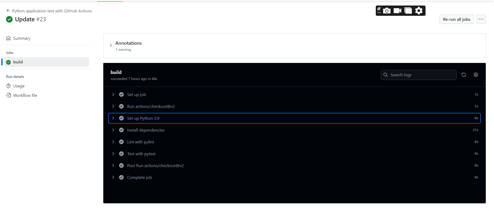

# Overview   
This project demonstrate how to manage and devlop a python project using CI/CD with Azure Devops
[](https://github.com/ngotrog/devops01/actions/workflows/main.yml)
## Project Plan
* Trello plan: https://trello.com/b/T5kKjvyj/q4-2024-trongnv11-udacity-devopsproject-2

* A link to a spreadsheet: https://docs.google.com/spreadsheets/d/1c76LrXG_IrZBJp0JiLOM2jbe4nSYSrsRsbuvpzVMhE0/edit?usp=sharing

## Instructions

### The architectural Diagram:


### Instructions for running the Python project
#### Project cloned into Azure Cloud Shell and test
Create a GubHub Repo (https://github.com/ngotrog/devops01.git)

Add created ssh key to your GitHub: Go to Settings => SSH and GPG keys => New SSH Key

* Open Cloud shell using bash and clone project then go to project folder:

 git@github.com:ngotrog/devops01.git

or

`$ git clone  git@github.com:ngotrog/devops01.git`

`$ cd devops01`


* Step testing 
python -m venv myproject
source myproject/bin/activate
Run make all to install dependency, test and lint your code using command: make all

* Testing result:
After above step you see dependencies are installed, lint rate 10/10 and tests are passed as below:


* Output of test run:

#### Project running on Azure App Service
Go to your Github Account and enable Github Actions
Replace .yml file with your code to make CI when any push actions perform
Push the changes to GitHub and verify that both lint and test steps pass in your project


CD Azure:
Run your app using command: python app.py

* You can deploy this project direct to azure using command:
az webapp up --name trongnv-app --resource-group trongnv11-rs --runtime PYTHON:3.9 --sku B1

And see the result deploy successfully:


Can go to the url and check as well:


Note: The app service was created before.

* Successful prediction from deployed flask app in Azure Cloud Shell.  [Use this file as a template for the deployed prediction](https://github.com/udacity/nd082-Azure-Cloud-DevOps-Starter-Code/blob/master/C2-AgileDevelopmentwithAzure/project/starter_files/flask-sklearn/make_predict_azure_app.sh).
The output should look similar to this:


Run prediction against a working devloyed Azure Application using command: 
```bash
$ chmod +xr make_predict_azure_app.sh
$ ./make_predict_azure_app.sh
```


* Output of streamed log files from deployed application

az webapp log tail -g trongnv11-rs --name trongnv-app


* Running Azure App Service from Azure Pipelines automatic deployment


 * Updated Load test an application using Locust
 

 * Locust report
 
## Enhancements
TODO: A short description of how to improve the project in the future>

* UI design
* Pipeline improvement for dev, staging, production
## Demo

Youtube link https://youtu.be/QfULnzeK45A
